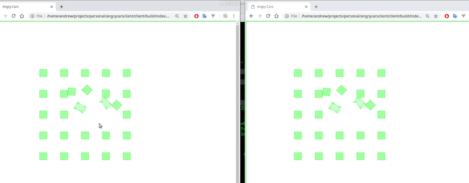

### Angry driver game server
Server parts of 2D multiplayer car fighting  simulator 

WIP

#### Implementation details:
   Network communication is implemented as JSON over WebSocket (libwebsocket) for simplicity and web-browser compatibility. 
   It is inefficient but works on LAN pretty well. 
   Binary protocol and delta compression is necessary to be implemented here.
   
   Physics world is simulated by Box2D engine.

#### Building:
Tested on linux but should be crossplatform. CMake 3.5 + is required.

    git clone 
    git submodule update --init
    cmake .
    make
    
#### Running:
    ./angryDriverServer
    
Use --help options to see options available
    
    
#### Client side

Client side is just dummy rendering for simple testing. Open clientTest/index.html in your browser to try. 
Use Arrow keys to control your car.

